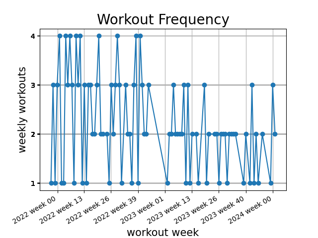
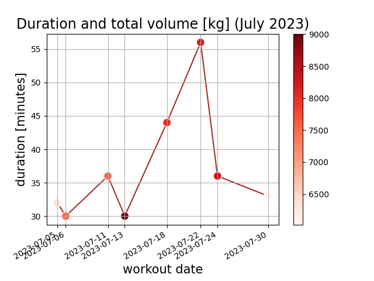
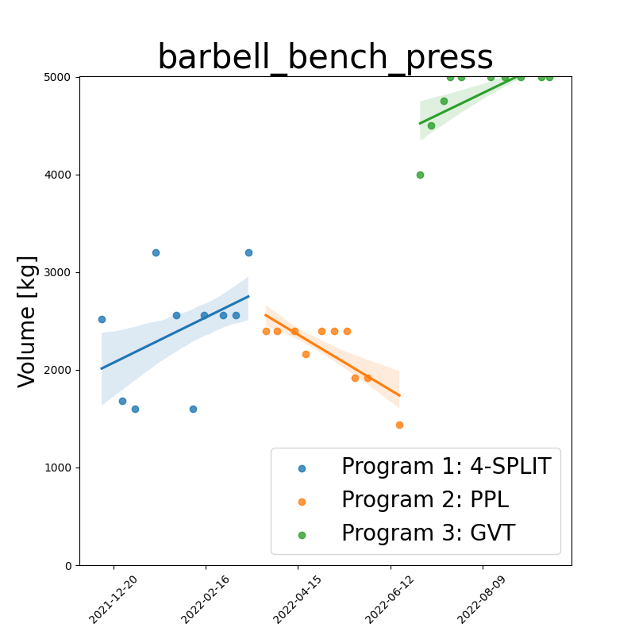
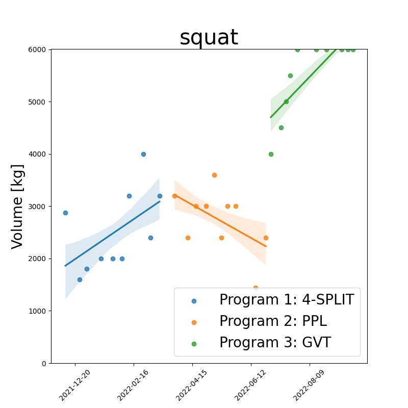
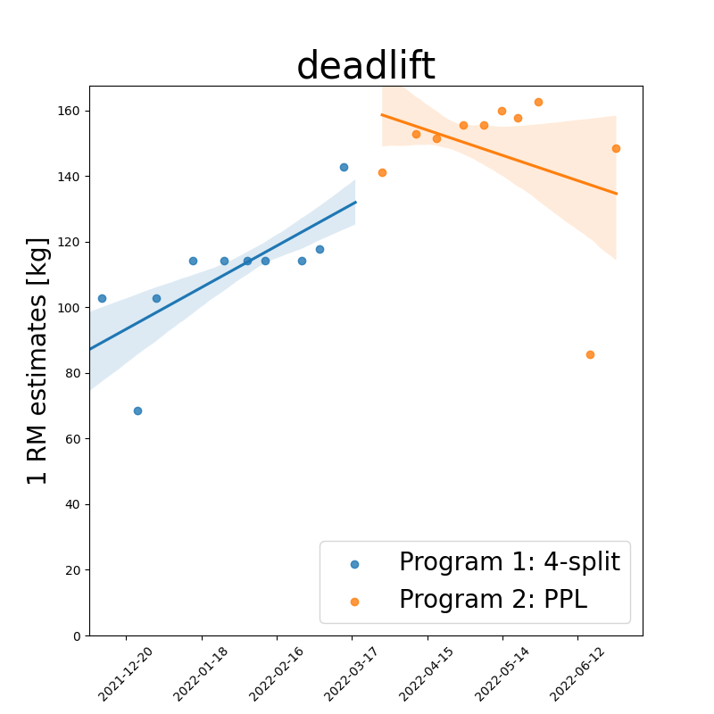
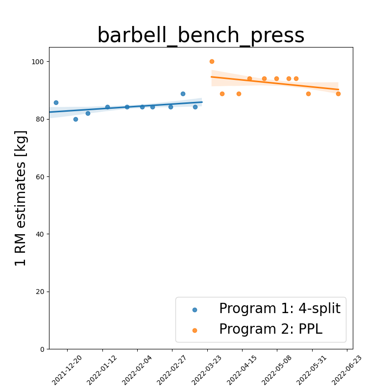
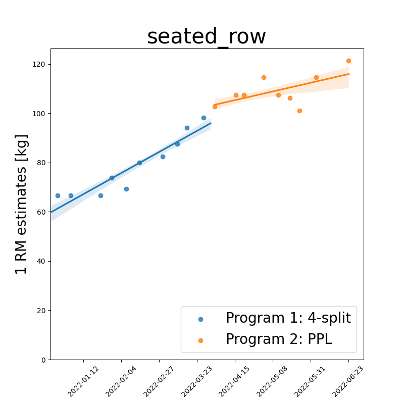
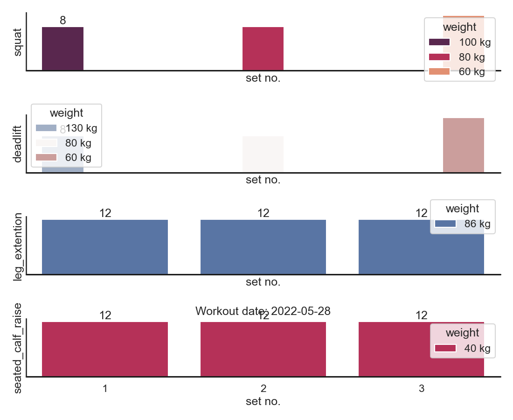

# Examples

<b>You can analyze your weight training workouts both in term of 1RM, or volume.
See examples for each type of analysis below.</b> 

Data and analysis for athlete: `gustav_rasmussen` 

VO2-Max: `55.21923 mL/kg/min` 

<!-- 

  

  

 -->

Weekly workout frequency

workout duration and volume

<a style="text-align: center;">[January 2023](img/workout_duration_January_2023.png) 
<a style="text-align: center;">[February 2023](img/workout_duration_February_2023.png) 
<a style="text-align: center;">[March 2023](img/workout_duration_March_2023.png) 
<a style="text-align: center;">[April 2023](img/workout_duration_April_2023.png) 
<a style="text-align: center;">[May 2023](img/workout_duration_May_2023.png) 
<a style="text-align: center;">[June 2023](img/workout_duration_June_2023.png) 
<a style="text-align: center;">[July 2023](img/workout_duration_July_2023.png)

<!-- | workout_duration                                                | workout_frequency                                                |
| --------------------------------------------------------------- | ---------------------------------------------------------------- |
|  |  | -->

Below: workout-date vs training volume (product between sets, reps and weight) 
for different training programs, together with their regression fits/trendlines 
using 68% confidence intervals. (Each program is shown in the legend)

| barbell_bench_press_volume                                                              | squat_volume                                                              |
| --------------------------------------------------------------------------------------- | ------------------------------------------------------------------------- |
|  |  |

Below: key exercises for overall strength indications. 
Each figure displays workout-date vs 1-rep-max estimate for different training programs, 
together with their regression fits/trendlines using 68 % confidence intervals. 
(Each program is shown in the legend)

|                        |            |
| :--------------------------------------------------------------------------------------: | :--------------------------------------------------------------------: |
|  |  |

<!-- Below: comparison between first leg workout of program 1
and last leg workout of program 2 for three selected exercises. 

|  |  |
| :---------------------------------------------------: | :--------------------------------------------------: | -->

### Lifting Vlog

- [deadlift](https://www.youtube.com/watch?v=HPr3-QgyXjM&ab_channel=GustavCollinRasmussen)
- [squat](https://www.youtube.com/watch?v=ig90_zeug54&ab_channel=GustavCollinRasmussen)
- [bench_press](https://www.youtube.com/watch?v=wT9kr8FA5tw&ab_channel=GustavCollinRasmussen)
- [leg_extention](https://www.youtube.com/watch?v=49hEuDi79AI&ab_channel=GustavCollinRasmussen)
- [skull_crusher](https://www.youtube.com/watch?v=85UbTjWuQig&ab_channel=GustavCollinRasmussen)

### Strava activities

<!-- <iframe height='454' width='300' frameborder='0' allowtransparency='true' scrolling='no' src='https://www.strava.com/athletes/77134512/latest-rides/0d0147f3e94a11a3d7f73b41ce73e1cfc0d9f557'></iframe> -->

[latest-runs](https://www.strava.com/athletes/77134512/latest-rides/0d0147f3e94a11a3d7f73b41ce73e1cfc0d9f557)
