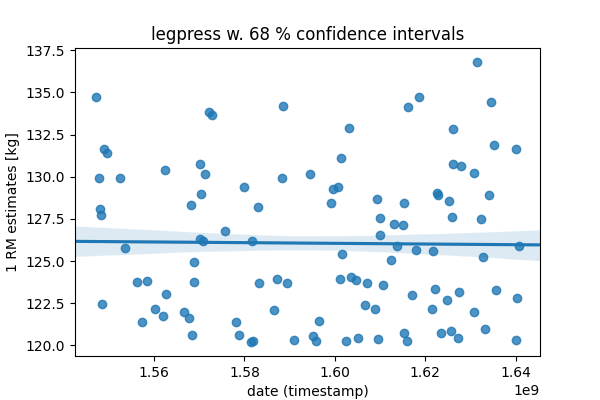
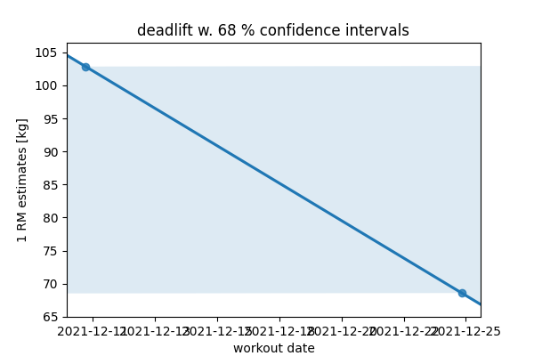
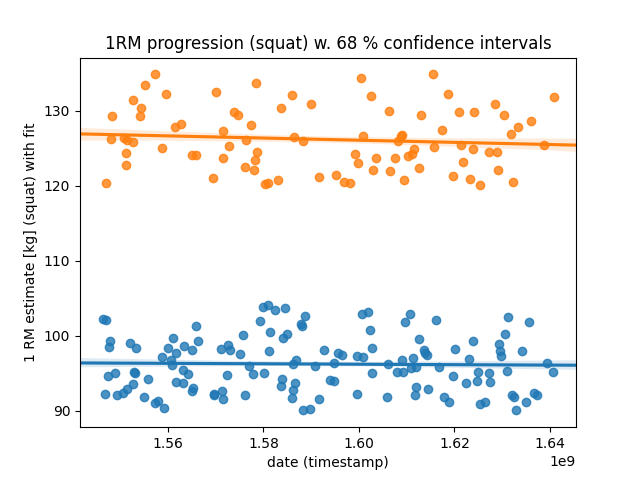
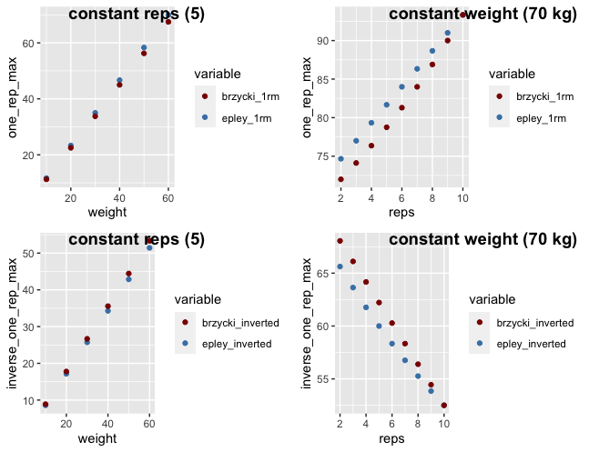
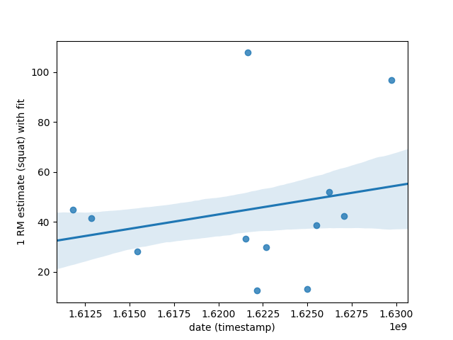

# Fitness-Tracker

Full stack fitness tracking application using TinyDB and FastAPI.
Add weight-training logs continuously to db.json and query the data through the browser.
Visually inspect your progression through dates and exercises

<!--  -->

|                 deadlift progression                  |                squat progression                |
| :---------------------------------------------------: | :---------------------------------------------: |
|  |  |

<!-- 

Above: selected exercises (sets vs reps, with weight resistance shown in the legend) for leg workout on 2021-12-11 -->

## Current features

- Catalogue of musclegroups, corresponding exercises and suggested weight ranges (for simulations)
- Realistic workout data simulation (with naturally progressing trend over time)
- Multiple GitHub Actions workflows
- 1 Rep Max estimation
- Plotting (Seaborn)
- Multiple unit test suites (Pytest)

## Upcoming features

- Add cardio tracking (integrate app with Strava)
- Bodily strength-ratio tracking (determine baseline, ideal-ranges, and compare the two)
- Documentation (Sphinx)
- ML models (Scikit Learn)
- YAML-support
- Dashboard
- Add key exercises (benchpress, squat, deadlift) to dashboard
- Hosting on PyPi (automated deploy with GitHub Actions)
- Identify musclegroups and exercises with best or worst progression
