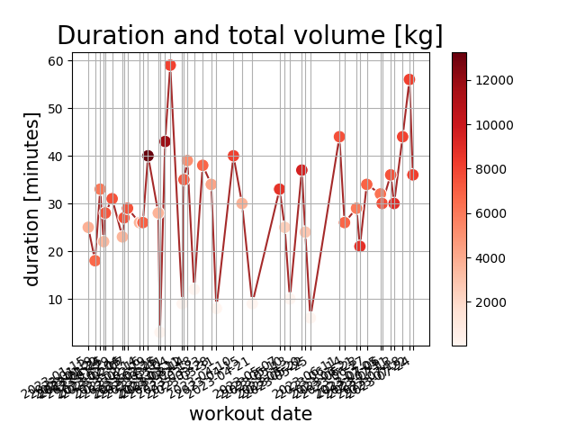

# Fitness-Tracker

[](https://fitness-tracker.readthedocs.io/en/latest/?badge=latest)
 [](https://codecov.io/gh/TheNewThinkTank/Fitness-Tracker) [](https://github.com/TheNewThinkTank/Fitness-Tracker/archive/refs/heads/main.zip)

<!--  -->

## Intro

Full stack fitness tracking application using TinyDB and FastAPI.
Add weight-training logs continuously to db.json and query the data through the browser.
Visually inspect your progression through dates and exercises

## Architecture Diagram


## Getting started

First, clone the project:<br>
`git clone https://github.com/TheNewThinkTank/Fitness-Tracker.git`

### Upload your workouts

- Add your workout log to the `data` folder under the correct workout date
- Edit `src/orchestration/real_flow.sh`: Specify the `WORKOUT_DATE` and `TRAINING_PROGRAM` values
- Execute `bash src/orchestration/real_flow.sh` which will insert your log(s) into the TinyDB database

### Analyze your data

Run FastAPI web app with Docker from CLI:
`docker-compose up`<br>
then visit the URL: http://localhost:8080/docs

Alternatively,

```BASH
docker build -t ftimage .
docker run -d -p 8000:8000 --name ftcontainer ftimage
```

### Update docs

```BASH
cd docs
make clean
sphinx-apidoc -o ./source ../src
make html
```

## Features

- FastAPI app "Fitness-Tracker", with TinyDB backend, exposed through Docker container
- Program logging (Located in folder: logs)
- Plotting (with the Seaborn library. Located in folder: img)
- Documentation (auto-generated by Sphinx and hosted on readthedocs: https://fitness-tracker.readthedocs.io/en/latest/index.html# )
- Multiple unit test suites (Pytest)
- BDD (Behavior Driven Development, using the Behave framework)
- Multiple GitHub Actions workflows
- Data quality validation (Great Expections)
- Package dependency management (Poetry)
- KPI tracking: 1-Rep-Max estimation (Epley and Brzycki formulas)
- Realistic workout data simulation (with naturally progressing trend over time)
- Catalogue of musclegroups, corresponding exercises and suggested weight ranges (for simulations)

## Examples

<b>You can analyze your weight training workouts both in term of 1RM, or volume.
See examples for each type of analysis below.</b><br>

Data and analysis for athlete: `gustav_rasmussen`<br>

VO2-Max: `55.21923 mL/kg/min`<br>

<!-- <p align="center">
  
</p>

<p align="center">
  
</p> -->

| workout_duration                                                | workout_frequency                                                |
| --------------------------------------------------------------- | ---------------------------------------------------------------- |
|  |  |

Below: workout-date vs training volume (product between sets, reps and weight)<br>
for different training programs, together with their regression fits/trendlines<br>
using 68% confidence intervals. (Each program is shown in the legend)

| barbell_bench_press_volume                                                              | squat_volume                                                              |
| --------------------------------------------------------------------------------------- | ------------------------------------------------------------------------- |
|  |  |

Below: key exercises for overall strength indications.<br>
Each figure displays workout-date vs 1-rep-max estimate for different training programs,<br>
together with their regression fits/trendlines using 68% confidence intervals.<br>
(Each program is shown in the legend)

|                        |            |
| :--------------------------------------------------------------------------------------: | :--------------------------------------------------------------------: |
|  |  |

<!-- Below: comparison between first leg workout of program 1
and last leg workout of program 2 for three selected exercises.<br>

|  |  |
| :---------------------------------------------------: | :--------------------------------------------------: | -->

### Lifting Vlog

- [deadlift](https://www.youtube.com/watch?v=HPr3-QgyXjM&ab_channel=GustavCollinRasmussen)
- [squat](https://www.youtube.com/watch?v=ig90_zeug54&ab_channel=GustavCollinRasmussen)
- [bench_press](https://www.youtube.com/watch?v=wT9kr8FA5tw&ab_channel=GustavCollinRasmussen)
- [leg_extention](https://www.youtube.com/watch?v=49hEuDi79AI&ab_channel=GustavCollinRasmussen)

### Strava activities

<!-- <iframe height='454' width='300' frameborder='0' allowtransparency='true' scrolling='no' src='https://www.strava.com/athletes/77134512/latest-rides/0d0147f3e94a11a3d7f73b41ce73e1cfc0d9f557'></iframe> -->

[latest-runs](https://www.strava.com/athletes/77134512/latest-rides/0d0147f3e94a11a3d7f73b41ce73e1cfc0d9f557)

### Similar projects
If you liked this fitness tracker then you might also be interested in
the [Dojo](https://gitlab.com/sports-tracking/dojo) martial arts project
which can be found on Gitlab and is a Rust & TypeScript based general purpose martial arts desktop application

<!--
## Upcoming features
- deploy and host containerized app on Raspberry Pi
- Add muscle groups to log file name
- ML models (Scikit Learn)
- YAML-support
- Bodily strength-ratio tracking (determine baseline, ideal-ranges, and compare the two)
- Dashboard
- Add key exercises (benchpress, squat, deadlift) to dashboard
- Hosting on PyPi (automated deploy with GitHub Actions)
- Identify musclegroups and exercises with best or worst progression
- Add cardio tracking (integrate app with Strava)
-->
