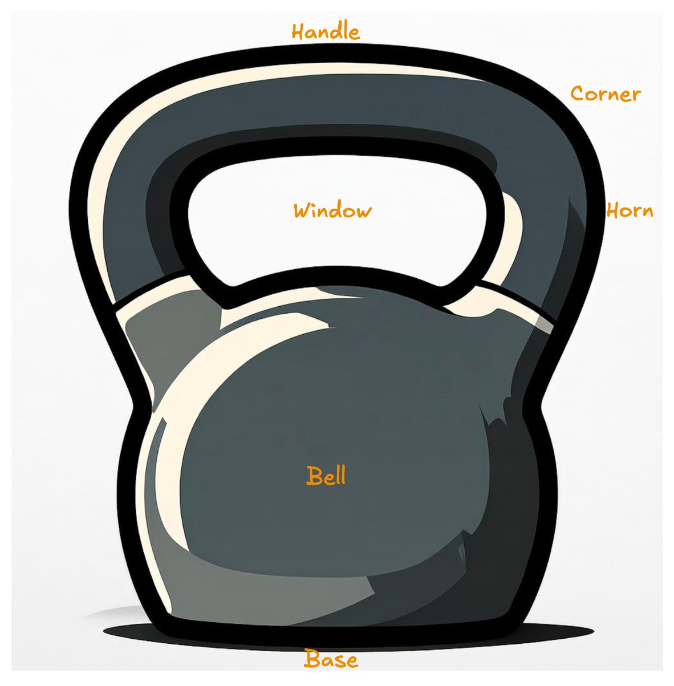

# Kettlebell

<!--  -->
<!--  -->

  

## Movements & exercise examples

- Push (e.g. Press)
- Pull (e.g. Row)
- Carry

## Exercise examples

- Swings
- Snatch
- Farmers walk

- EMOM
- AMRAP
- Flow
- Complex

## Grips

- Finger grip
- Hook grip
