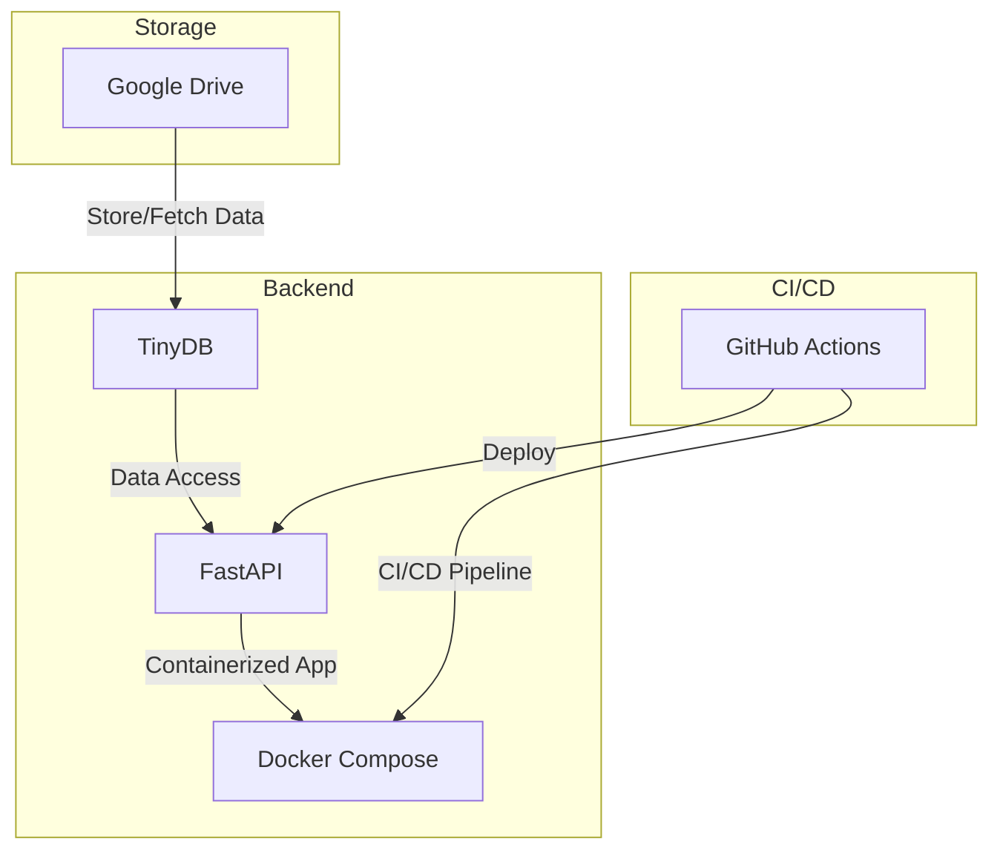

# Architecture

```mermaid
graph TD
    A[Google Drive] -->|Store/Fetch Data| B[TinyDB]
    B -->|Data Access| C[FastAPI]
    C -->|Containerized App| D[Docker Compose]
    E[GitHub Actions] -->|CI/CD Pipeline| D
    E -->|Deploy| C

    subgraph Backend
        B
        C
        D
    end

    subgraph CI/CD
        E
    end

    subgraph Storage
        A
    end
```
