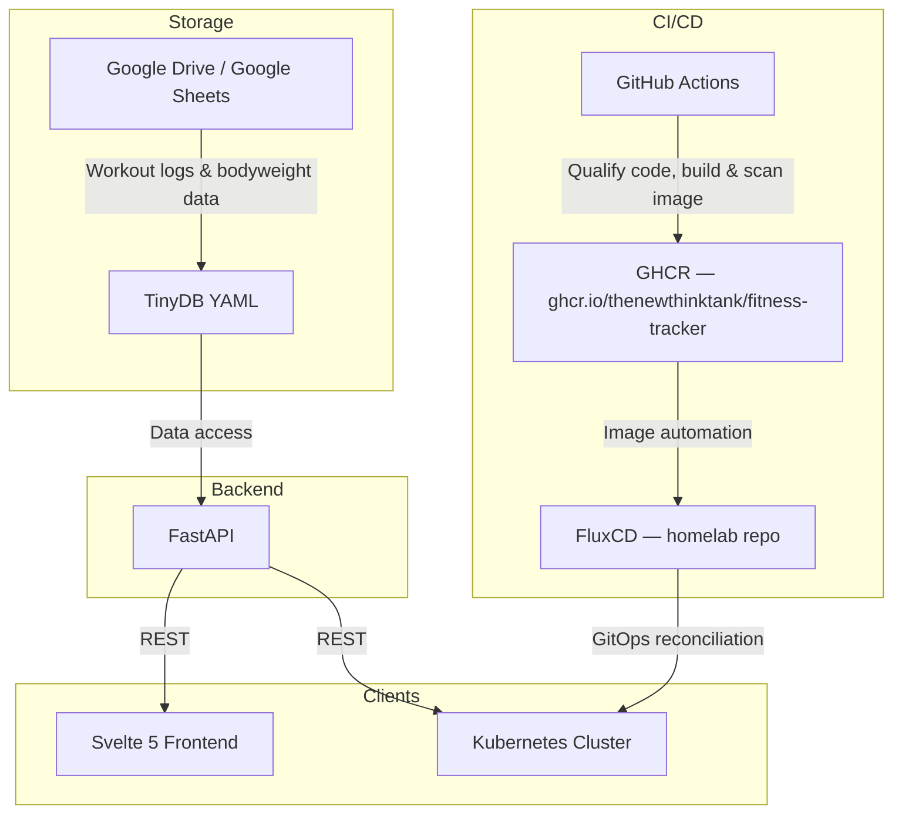

# Architecture

```mermaid
graph TD
    GD[Google Drive / Google Sheets] -->|Workout logs & bodyweight data| TDB[TinyDB YAML]
    TDB -->|Data access| API[FastAPI]
    API -->|REST| FE[Svelte 5 Frontend]
    API -->|REST| K8S[Kubernetes Cluster]

    subgraph Storage
        GD
        TDB
    end

    subgraph Backend
        API
    end

    subgraph Clients
        FE
        K8S
    end

    subgraph CI_CD [CI/CD]
        GHA[GitHub Actions]
        GHCR[GHCR — ghcr.io/thenewthinktank/fitness-tracker]
        FLUX[FluxCD — homelab repo]
        GHA -->|Qualify code, build & scan image| GHCR
        GHCR -->|Image automation| FLUX
        FLUX -->|GitOps reconciliation| K8S
    end
```
