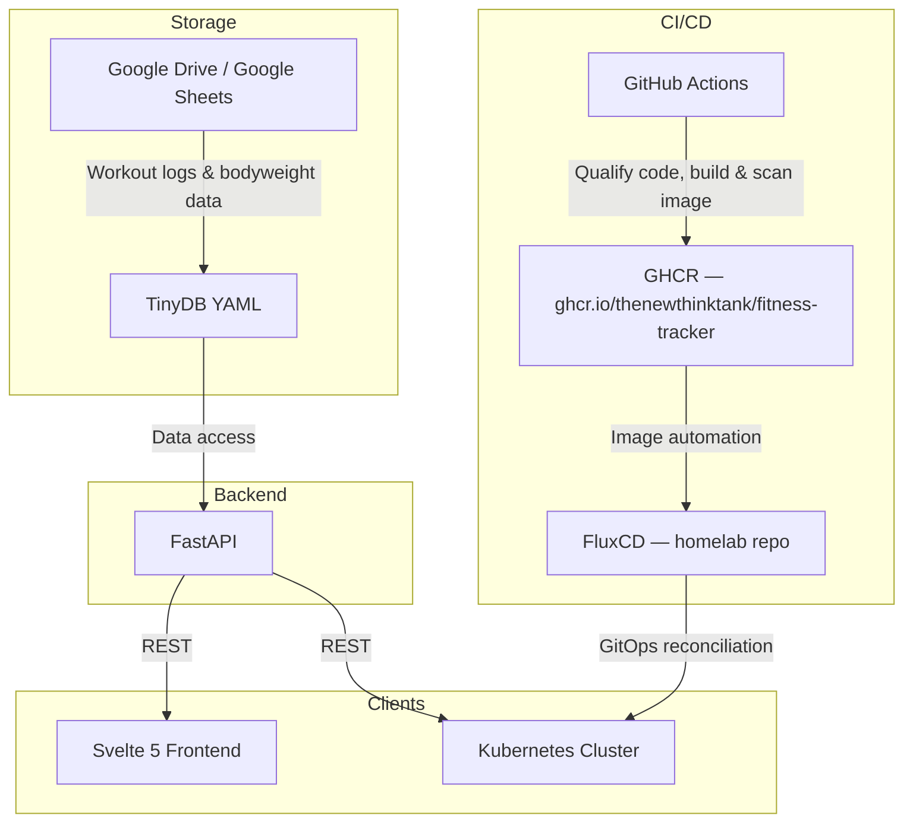

# Architecture

The diagram summarizes external integrations and image deployment. The browser
request path and the writable-state boundary are described under
[Application runtime](#application-runtime); the diagram does not show those
components.

## Application runtime

The Svelte 5 and TypeScript frontend uses relative `/api` requests. Vite forwards
them in development; Nginx forwards them in the production frontend container.
The proxy preserves the browser's host and adds any configured service API key
server-side. The key is not compiled into public assets. Zod validates API
responses and workout inputs before the UI uses or submits them.

FastAPI combines two storage sources:

- **Imported archives:** TinyDB YAML files under the configured data directory.
    Validated snapshots and an ID index cache reads, with file identity and
    timestamps invalidating changes. API reads never rewrite YAML, and Compose
    mounts it read-only.
- **Application state:** transactional SQLite containing new workouts, edits,
    deletion markers, body measurements, program-target overrides, and athlete
    authentication state. Compose provides a separate writable `state` volume
    owned by the backend's non-root user.

The merged read model includes years introduced by browser-created workouts,
even when no YAML archive exists for that year. Workout IDs are immutable UUIDs;
updates and deletes require the current `If-Match` version to reject stale
writes. Analytics use the same merged records, so a saved workout contributes
to activity, duration, and known-load volume without an archive rewrite.

Workout entry is opt-in. A provisioned single-athlete password protects reads
and enables sign-in; writes additionally require the enable-writes setting,
a same-origin request, and a session CSRF header. Session cookies are HttpOnly
and SameSite=Strict, and password changes revoke sessions. Session-protected
responses use `no-store`; public deployment also requires HTTPS and Secure
cookies.

The **Log workout** action opens the lazy-loaded editor from any frontend view.
Successful creation selects Archive, the saved year, and the new workout's URL.
The editor locks controls during submission and retains drafts for retryable
failures. Existing workout edits retain the active view and use version-aware
updates. See the [frontend workflow](../examples/svelte_frontend_setup.md)
for the user-facing steps.

## Container and backup boundaries

The backend image includes API dependencies and bundled exercise/program
metadata, and runs one Uvicorn worker. The frontend runtime image contains
Nginx and the compiled static assets, not the frontend development toolchain.
Both services use non-root users, read-only root filesystems, temporary writable
directories, dropped capabilities, and health-gated startup.

Back up YAML and SQLite state together. Stop the backend or use SQLite's backup
API before copying an active database. Keep a single YAML writer and avoid
editing the same imported record concurrently through the CLI and frontend.
Browser write tests must use disposable state; see
[browser workflow checks](../examples/EXAMPLES.md#browser-workflow-checks).
