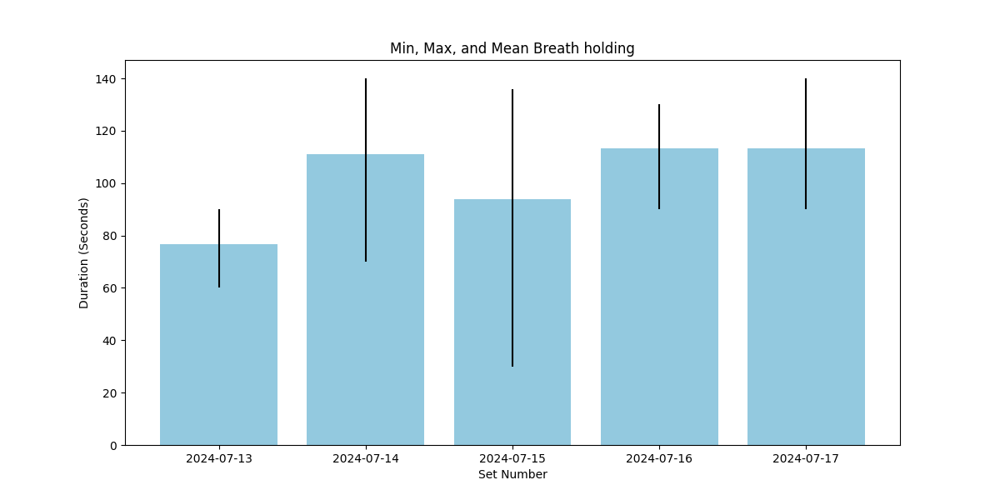

# Breath holding

Each bar represents breath holds on a given date.
The bar height is the mean duration of that date's breath holds,
the top and bottom of the error bar represents the max and min durations respectively.
