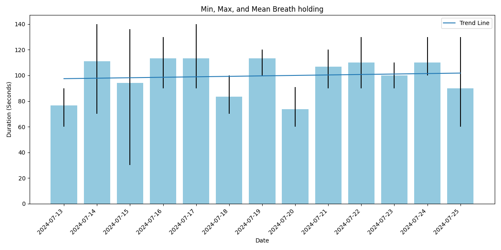

# Breath holding

The below examples are performed by Gustav Rasmussen,
following principles from [Breatheology](https://www.breatheology.com/),
laid out by Stig Severinsen.

Never hold your breath alone under water,
and consider consulting
[this book](https://books.google.dk/books/about/Breatheology.html?id=q3OJZwEACAAJ&source=kp_book_description&redir_esc=y)
for effective breathing exercises 

Each bar represents breath holds on a given date.
The bar height is the mean duration of that date's breath holds,
the top and bottom of the error bar represents the max and min durations respectively.
The fit shows the Linear Trend Line to the Mean Durations
