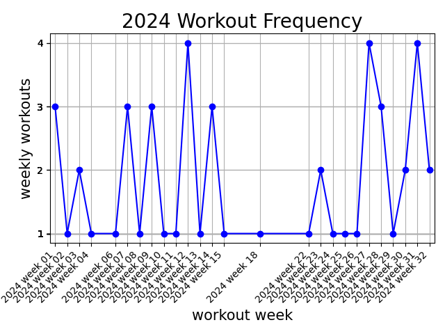
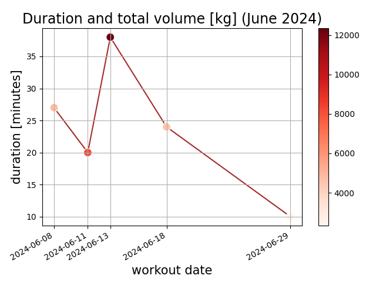
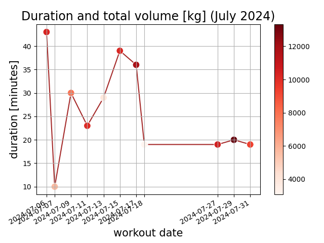

# Examples

<b>You can analyze your weight training workouts both in term of 1RM, or volume.
See examples for each type of analysis below.</b> 

Data and analysis for athlete: `gustav_rasmussen` 

VO2-Max: `55.21923 mL/kg/min` 

## Frequency

Below: Annual weekly workout frequency. 
Each figure displays week vs number of workouts during that week.

|  |  |
| :----------: | :------: |
|  |  |

## Duration and volume
<!-- 
Workout duration and volume
 -->

|  |  |
| :----------: | :------: |
|  |  |
|  |  |
|  |  |

#### 2023:

- <a style="text-align: center;">[December](../img/workout_duration_December_2023.png) 
- <a style="text-align: center;">[November](../img/workout_duration_November_2023.png) 
- <a style="text-align: center;">[October](../img/workout_duration_October_2023.png) 
- <a style="text-align: center;">[September](../img/workout_duration_September_2023.png) 
- <a style="text-align: center;">[August](../img/workout_duration_August_2023.png) 
- <a style="text-align: center;">[July](../img/workout_duration_July_2023.png) 
- <a style="text-align: center;">[June](../img/workout_duration_June_2023.png) 
- <a style="text-align: center;">[May](../img/workout_duration_May_2023.png) 
- <a style="text-align: center;">[April](../img/workout_duration_April_2023.png) 
- <a style="text-align: center;">[March](../img/workout_duration_March_2023.png) 
- <a style="text-align: center;">[February](../img/workout_duration_February_2023.png) 
- <a style="text-align: center;">[January](../img/workout_duration_January_2023.png) 

## Volume

<!-- 
Workout volume
 -->

[Volume plots](VOLUME.md)

## Strength

<!-- 
Strength estimation
 -->

[Strength plots](STRENGTH.md)

### Lifting Vlog

- [deadlift](https://www.youtube.com/watch?v=HPr3-QgyXjM&ab_channel=GustavCollinRasmussen)
- [squat](https://www.youtube.com/watch?v=ig90_zeug54&ab_channel=GustavCollinRasmussen)
- [bench_press](https://www.youtube.com/watch?v=wT9kr8FA5tw&ab_channel=GustavCollinRasmussen)
- [leg_extention](https://www.youtube.com/watch?v=49hEuDi79AI&ab_channel=GustavCollinRasmussen)
- [skull_crusher](https://www.youtube.com/watch?v=85UbTjWuQig&ab_channel=GustavCollinRasmussen)

### Strava activities

[latest-runs](https://www.strava.com/athletes/77134512/latest-rides/0d0147f3e94a11a3d7f73b41ce73e1cfc0d9f557)
