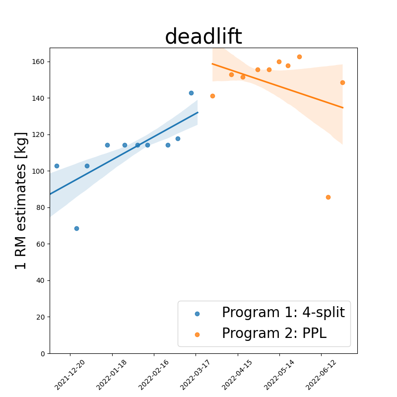
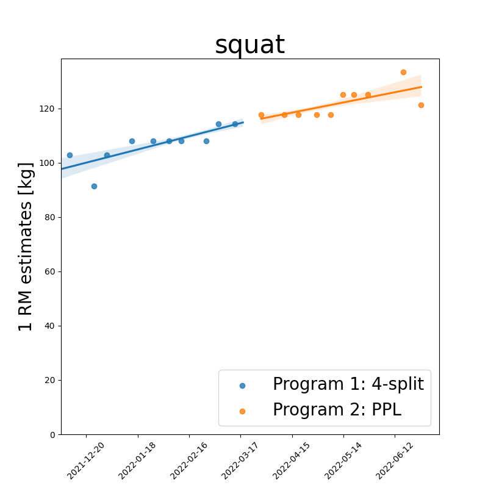
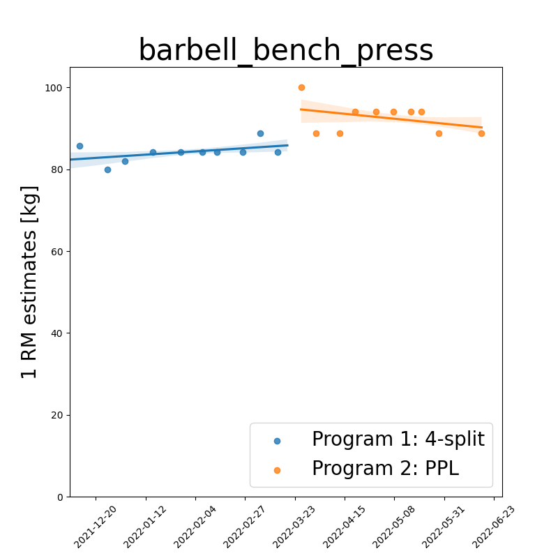
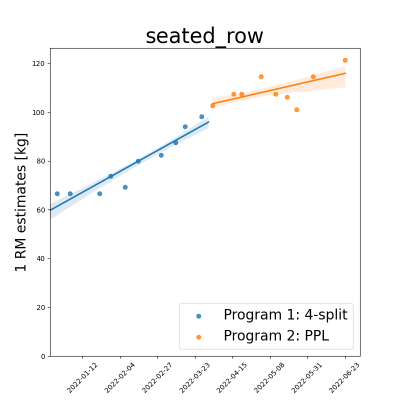

Below: key exercises for overall strength indications. 
Each figure displays workout-date vs 1-rep-max estimate for different training programs, 
together with their regression fits/trendlines using 68 % confidence intervals. 
(Each program is shown in the legend)

|                        |            |
| :--------------------------------------------------------------------------------------: | :--------------------------------------------------------------------: |
|  |  |
