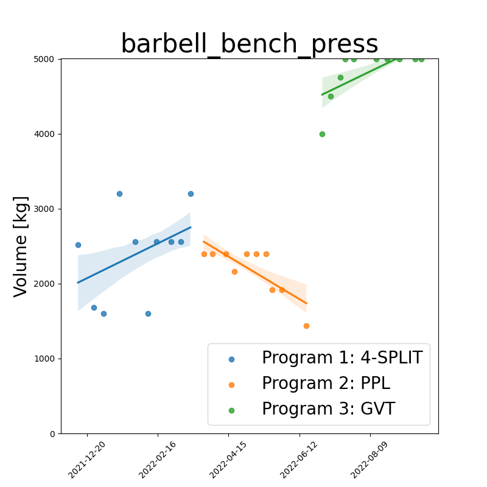
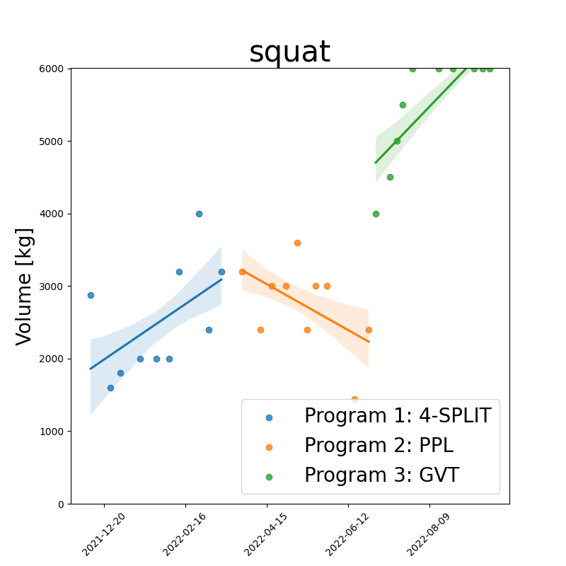

# Volume

Below: **workout-date** vs **training volume** (product between sets, reps and weight) 
for different training programs, together with their regression fits/trendlines 
using 68% confidence intervals. (Each program is shown in the legend).

| barbell_bench_press_volume | squat_volume |
| -------------------------- | ------------ |
|  |  |

<!--
| barbell_bench_press_volume | squat_volume |
| -------------------------- | ------------ |
|  |  |
-->
